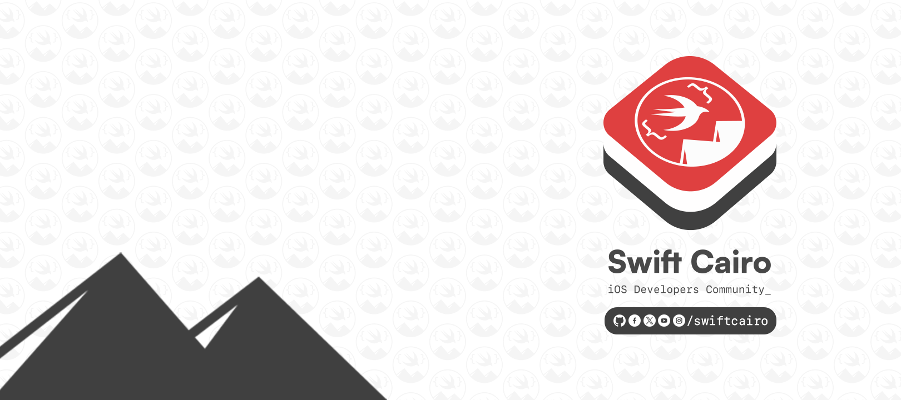

  

# MeetupSessions

Welcome to the Cairo iOS Developers meetup repo. This is a repo to share our meetup materials(videos/Slides).

Join us: [Meetup.com](https://www.meetup.com/Swift-Cairo-iOS-Developers-Meetup/) |
[Slack](https://join.slack.com/t/swiftcairo/shared_invite/enQtMzUwMzI4ODc4NDMyLTM5NTQyYjFhZGJkNThjZjhmZTIxNmU4MDI1MDJjNDI5NDI5YWNjY2NkOTU1MDc3NzJjNjViZGMzMDljZWU2Zjk)
| [X](http://x.com/swiftcairo/) | [Youtube](https://www.youtube.com/channel/UC35fDS6vgZSdHol5WguMqEg?) | [Facebook](http://facebook.com/swiftcairo/)

## 1st Meetup 09/05/18:

- 1: Yousef Hamza - Container ViewControllers : [Slides](01st%20Meetup-May2018/Instabug-Meetup.key)
- 2: Abdolerhman Eaita - Rebooting Network layer : [Slides](https://github.com/Yoloabdo/RebootingNetwork/blob/master/Rebooting%20Network.key) - [Video](https://www.youtube.com/watch?v=4SQnPJao40g&t=1028s)
- 3: Sally Ahmed - Enforcing swift style : [Slides](01st%20Meetup-May2018/how%20can%20i%20enforce%20swift%20style%20-%20Sally%20Ahmed.pdf)

## 2nd Meetup 20/06/18:

- 1: Ahmed Adel - Modern Software Design: [Slides](02nd%20Meetup-Jun2018/Modern%20Software%20Design.pdf) - [Video](https://youtu.be/DrTPet0NVo4)
- 2: Hesham Halim - Massive view controller: [Slides](02nd%20Meetup-Jun2018/Massive%20View%20Controller/Massive-View-Controller.pdf) - [Demo](02nd%20Meetup-Jun2018/Massive%20View%20Controller/MVVMSample-master) - [Video](https://youtu.be/4MmhcvS7FHg)
- 3: Khaled Mohamed - Thread Safe: [Slides](02nd%20Meetup-Jun2018/Threadsafe/Instabug_iOS.key)
- 4: Mohamed Hamed - Dependency Managers: [Slides](02nd%20Meetup-Jun2018/Dependency%20Managers.pdf)
- 5: Ahmed Ramy - Sharing! : [Slides](02nd%20Meetup-Jun2018/Blogging%20Session.key)

## 3rd Meetup 01/08/18:

- 1: Osama Dawood - Designer vs Developer: [Slides](03rd%20Meetup-Aug2018/UI-Approaches)
- 2: Mohamed Ennabah/Abdolerhman Eaita - Approaches to UI-Development: [Slides](03rd%20Meetup-Aug2018/Osama-Presentation.pdf)
- 3: Osama Gamal - iOS reverse engineering: [Slides](03rd%20Meetup-Aug2018/iOSReverseEngineering1.2.pdf)

## 4th Meetup 01/10/18:

- 1: Ahmed Abd ElMeguid - CI/CD : [Demo](04th%20Meetup-Oct2018/CI-Meguid/Demo/travis-ci-pipeline-master) - [Slides](04th%20Meetup-Oct2018/CI-Meguid/Slides)

## 5th Meetup 21/10/18:

- 1: Mostafa Abdellateef - User access management: [Library](https://github.com/mmabdelateef/Koosa) - [Slides](https://speakerdeck.com/mmabdelateef/access-control-management-with-swift)
- 2: Ahmed Essam - Let's tool it! : [Code](https://github.com/aessam/SwiftCairoToolsDemo) - [Video](https://www.youtube.com/watch?v=c5c42DneGdY)

## 6th Meetup 30/01/19:

- 1: Karim Ebrahem - Auto Boilerplate Code in Swift: [Demo](https://github.com/KarimEbrahemAbdelaziz/SwiftCairoTalk) - [Slides](06th%20Meetup-Jan2019/Karim%20Ebrahim)
- 2: Omar Sherif - Dynamic libraries and llvm intro

## 7th Meetup 24/04/19:

- 1: [Attia Mohamedein](https://twitter.com/attiamothedev): [Slides](https://speakerdeck.com/attiamohamedein/intro-to-reactive-programming-in-ios-using-rxswift)
- 2: Ahmed Ramy: : [Demo](https://github.com/ARamy23/Vapor-Init)
- 3: Abdoelrahman Eaita: Design patterns in practice [Article](https://blog.usejournal.com/practical-uses-of-design-patterns-in-ios-development-command-pattern-c58941d6cc99)

## 8th Meetup 03/07/19:

- 1: Ehab Amer - Memory Management In Swift: [Slides](https://www.dropbox.com/s/9yy7jyjlrjevf72/Memory%20Managment.zip?dl=0)
- 2: Ahmed Khalf - Async Drwaing: : [Slides & Demo](https://github.com/ahmedk92/AsyncDrawing)

## 9th Meetup 17/09/19:

- 1: Omar Sherif - Back to future: [Slides](https://github.com/cg-jedi/Swift_Cairo_Talk_2)
- 2: Fadi Botros - Multithreading & Parallelism: [Slides](09th%20Meetup-Sept2019/Fadi%20Botros)

## 10th Meetup 12/11/19:

- 1: Peter Mosaad - Conductors & Boundaries: [Slides](10th%20Meetup-Nov2019) - [Demo](https://github.com/PeterMosaad/conductors-demo)
- 2: Magdy Zamel - Advanced CollectionView Layout: [Slides](https://drive.google.com/open?id=1VEPyfL3a4iqIU6gnQxDPftiF1KkIgsOl) - [Demo](https://github.com/MagdyZamel/MSZCollectionViewLayout)

## 11th Meetup 25/12/19:

- 1: Attia Mo - Code Reveiw: [Slides](11th%20Meetup-Dec2019) - [Video](https://www.youtube.com/watch?v=NRHoElHgekE)
- 2: Live Q & A with Moustafa Nagueeb: [Video](https://www.youtube.com/watch?v=QTD1_ru9kY0)

## 12th Meetup 18/03/20:

- 1: Shady Selim - Kotlin native for iOS and Android: [Slides](https://www.slideshare.net/bagaa/kotlin-native-for-ios-and-android)
- 2: Olla Ashour - Debugging and Xcode Tools: [Slides](12th%20Meetup-Mar2020)
- 3: Video: [Youtube](https://www.youtube.com/watch?v=FxihiBN1f60&fbclid=IwAR2tIwP5EhpAC_BcqRNODffyzuARz8VxY1JOrFkZEmd3aQ8ilvsqf2yq7Jw)

## 13th Meetup 18/01/23:
📍 Hosted by: [Jumia](https://group.jumia.com/)
- 1: [Marcel Adel](https://eg.linkedin.com/in/marcel-adel-b6681943) - How to build a stable system. [Slides](13th%20Meetup-Jan2023/How%20to%20build%20a%20stable%20system)
- 2: [Ahmed Ramy](https://ae.linkedin.com/in/aramy23) - Architecture Homicide. [Slides & Recommendations](13th%20Meetup-Jan2023/Architecture%20Homicide)

## 14th Meetup 07/06/23:
📍 Hosted by: [Careem](https://www.careem.com/)
- 1: [Osama Gamal](https://eg.linkedin.com/in/osamagamall) - Modular iOS Architecture: Large Scale Apps. [Demo & Slides](14th%20meetup-June2023/Modular%20iOS%20Architecture)
- 2: [Ahmed M. Hassan](https://eg.linkedin.com/in/ahmdmhasn) - Clean Architecture with MVVM-IO. [Demo & Slides](14th%20meetup-June2023/Clean%20Architecture%20With%20MVVM)

## 15th Meetup 25/06/24:
📍 Hosted by: [Consoleya](https://consoleya.com/)
- 1: [Ahmed Ramy](https://ae.linkedin.com/in/aramy23) | [Ahmad Yasser](https://eg.linkedin.com/in/ahmdyasser) - Swift Tooling. [Slides](15th%20Meetup-June2024/Swift%20Tooling%20%7C%20Ahmed%20Ramy%20%26%20Ahmad%20Yasser)
- 2: [Moustafa Hegazy](https://eg.linkedin.com/in/moustafa-hegazy-ios-dev) - Phantom Types. [Slides](15th%20Meetup-June2024/Phantom%20Types%20%7C%20Moustafa%20Hegazy)

## 16th Meetup 24/07/24:
📍 Hosted by: [Instabug](https://www.instabug.com/)
- 1: [Ahmed Salah](https://eg.linkedin.com/in/ahmedsalah196) - Quality Practices. [Slides](16th%20Meetup-July2024/Quality%20Pracatices%20%7C%20Ahmed%20Salah)
- 2: [Mostafa Nafie](https://eg.linkedin.com/in/mostafanafie) - Demystifying Dependency Injection. [Slides](16th%20Meetup-July2024/Demystifying%20Dependency%20Injection%20%7C%20Mostafa%20Nafie)

## 17th Meetup 28/08/24:
📍 Hosted by: [Klivvr](https://www.klivvr.com/)
- 1: [Norhan Boghdadi](https://eg.linkedin.com/in/norhan-boghdadi) | [Shehab Elnoury](https://eg.linkedin.com/in/shehabelnoury) - Bridging Design and Development. [Slides](17th%20Meetup-Aug2024/Bridging%20Design%20and%20Development%20%7C%20Norhan%20Boghdadi%20-%20Shehab%20Elnoury/Bridging%20Design%20and%20Development.pdf)
- 2: [Ahmad Yasser](https://eg.linkedin.com/in/ahmad-yasser-294406191) | [Hatem Abdallah](https://www.linkedin.com/in/hatemabdallah/) - Mobile Security - Hardening iOS Apps. [Slides](17th%20Meetup-Aug2024/Mobile%20Security%20-%20Hardening%20iOS%20Apps%20%7C%20Ahmad%20Yasser%20-%20Hatem%20Abdallah)
- 3: [Ahmed Ramzy](https://eg.linkedin.com/in/iramzyy) | [Asmaa Magdy](https://eg.linkedin.com/in/asmaamagdy) | [Mostafa Arous](https://www.linkedin.com/in/mostafa-arous-848909142/) - The Power of Mobile Events & A/B Testing. [Slides](17th%20Meetup-Aug2024/The%20Power%20of%20Mobile%20Events%20%26%20A%3AB%20Testing%20%7C%20Ahmed%20Ramzy%20%7C%20Asmaa%20Magdy%20%7C%20Mostafa%20Arous)

All videos are on our [YouTube channel](https://www.youtube.com/swiftcairo), so subscribe!
